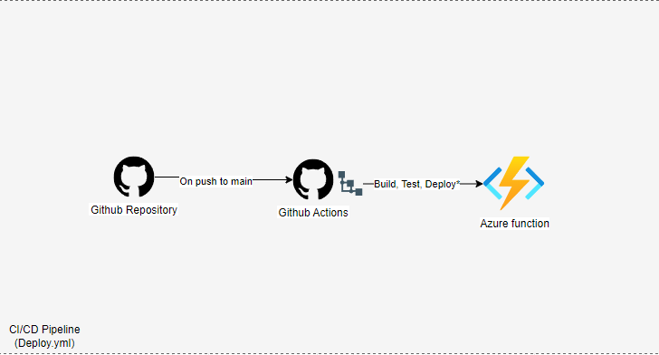
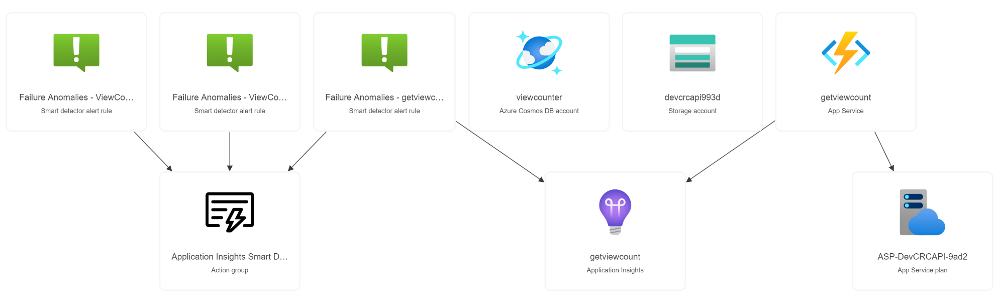

# Getviewcount Web API

## Overview

The `getviewcount` Web API is an **Azure Function** that increments then retrieves a "view count" variable from a **CosmosDB database**. It's designed to be triggered via HTTP, supporting both GET and POST methods. This repository contains the necessary code and configuration files for deploying the function to Azure with unit testing with Jest and E2E testing with Cypress.

The web api serves as a view counter RESTful API for the [frontend](https://github.com/hughdtt/cloud-resume-frontend) of the [Cloud Resume Challenge](https://cloudresumechallenge.dev/).

## Install

You can download the repo to test it locally if you'd like. You'll just need to have Azure Function Core Tools installed.

### Local Development

1. Clone the repository
2. Install the dependencies using `npm install`
3. Install Azure Functions Core Tools using `npm install -g azure-functions-core-tools --unsafe-perm true` (read more at [Azure Functions](https://learn.microsoft.com/en-us/azure/azure-functions/functions-run-local?tabs=windows%2Cportal%2Cv2%2Cbash&pivots=programming-language-csharp))
4. Run locally `azurefunctions run`
5. [Optional] Run unit tests using `npm test`
6. [Optional] Run smoke tests using `npm cypress` (although my cypress config points to my production api endpoint, you might need to change it. More on [environment variables](https://docs.cypress.io/guides/guides/environment-variables))

## Code deployment strategy

For illustrative purposes, deployment flow has been drawn below.

### Diagram

### Detailed workflow description

Deploy.yml job steps:

- **Track changes for certain folders** For efficiency, I only want workflow to run when certain folders have been changed - ie. not when readme has changed.
- **Checkout Code:** Clones the repository code.
- **Install Dependencies:** Installs all required dependencies (including tests).
- **Run Jest Tests:** Executes unit tests using Jest.
- **Clean Libraries:** Removes development dependencies (omitting dev) to create a lightweight package for deployment.
- **Create ZIP Package:** Zips necessary files and directories for deployment.
- **Deploy Azure template:** Checks to see if resources are present before deploying, if yes deploy, if no run error.
- **Deploy to Azure Functions:** Uses `Azure/functions-action@v1` to deploy the ZIP package to the specified Azure Functions app.
- **Run Cypress Tests:** Check that endpoint works as it should.

### Deploying Azure resources

[doc](https://learn.microsoft.com/en-us/azure/azure-resource-manager/templates/deploy-github-actions?tabs=userlevel)

### Considerations

The CI/CD pipeline above is quite simple and doesn't really simulate what you might see in a production environment. You'd really want to add something like deploying "Staging" resources and then merging feature code there first to preview. Once integration tests pass and you have a preview in the "Staging" environment, you could add a step to destroy the "staging" resources before deploying code to production environment.

## Infrastructure deployment strategy

Infrastructure-as-Code (ARM templates) have also been provided. You could manually run the github action workflow `insert workflow name` to deploy. You'll need to update your repository with the relevant secrets etc.

### Azure resource group relationship model

ARM Template should deploy the following resources:

## Acknowledgements
This was done as part of Forrest Brazeal's [Cloud Resume Challenge](https://cloudresumechallenge.dev/).

## Further considerations
### Mod Explorations

### Task list
- [x] Manually setup azure function + cosmosDB
- [x] Using Azure Portal GUI, write function and get function to increment and update cosmosdb entry
- [x] Download Azure function files to test locally (Kudu app service via portal)
- [x] Install Azure function core tools and Azure code extensions.
- [x] Test function locally
- [x] Unit test w/ Jest
- [x] E2E test w/ Cypress
- [x] Git repo as source
- [x] Deploy yaml
    - [x] Tests, build artifacts, deploy to Azure
- [x] Diagrams
    - [x] CI/CD Pipeline
    - [x] Web API Architecture
    - [x] Resource group relations
- [ ] ARM template files for resource group (environment agnostic ie staging/prod)
- [ ] YAML infrastructure deploy

