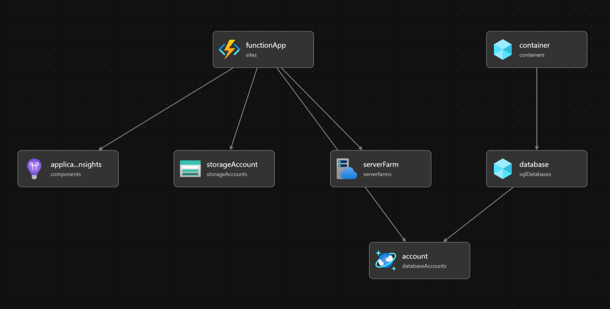

# Getviewcount Web API

## Overview

The `getviewcount` Web API is an **Azure Function** that increments then retrieves a "view count" variable from a **CosmosDB database**. It's designed to be triggered via HTTP, supporting both GET and POST methods. This repository contains the necessary code and configuration files for deploying the function to Azure with unit testing with Jest and E2E testing with Cypress.

The web api serves as a view counter RESTful API for the [frontend](https://github.com/hughdtt/cloud-resume-frontend) of the [Cloud Resume Challenge](https://cloudresumechallenge.dev/).

Solid CI/CD has been implemented. If the Azure resource group exists, it'll deploy the necessary resources, unit test the code, deploy code to Azure function and test the prod api url returns the correct response.

## Install

You can download the repo to test it locally if you'd like. You'll just need to have Azure Function Core Tools installed.

### Local Development

1. Clone the repository
2. Install the dependencies using `npm install`
3. Install Azure Functions Core Tools using `npm install -g azure-functions-core-tools --unsafe-perm true` (read more at [Azure Functions](https://learn.microsoft.com/en-us/azure/azure-functions/functions-run-local?tabs=windows%2Cportal%2Cv2%2Cbash&pivots=programming-language-csharp))
4. Create local.settings.json file with connection strings.
5. Run locally `azurefunctions run`
6. [Optional] Run unit tests using `npm test`
7. [Optional] Run smoke tests using `npm cypress` (although my cypress config points to my production api endpoint, you might need to change it. More on [environment variables](https://docs.cypress.io/guides/guides/environment-variables))

## Code deployment strategy

For illustrative purposes, deployment flow has been drawn below.

### Diagram

### Detailed workflow description

Deploy.yml job steps:

- **Track changes for certain folders** For efficiency, I only want workflow to run when certain folders have been changed - ie. not when readme has changed.
- **Checkout Code:** Clones the repository code.
- **Install Dependencies:** Installs all required dependencies (including tests).
- **Run Jest Tests:** Executes unit tests using Jest.
- **Clean Libraries:** Removes development dependencies (omitting dev) to create a lightweight package for deployment.
- **Create ZIP Package:** Zips necessary files and directories for deployment.
- **Deploy Azure template:** Deploy resources based on bicep file. It's set to complete meaning it'll delete things that aren't set by the file. Won't duplicate resource if it already exists.
- **Deploy to Azure Functions:** Uses `Azure/functions-action@v1` to deploy the ZIP package to the specified Azure Functions app.
- **Run Cypress Tests:** Check that endpoint works as it should.

### Deploying Azure resources

Read more on this [doc](https://learn.microsoft.com/en-us/azure/azure-resource-manager/templates/deploy-github-actions?tabs=userlevel)

### Considerations

Could also add some better parameters for a "staging" environment preview in the build.

## Infrastructure deployment strategy

Infrastructure-as-Code (Bicep template) have also been provided.
When deploying resource, you'll need to update cosmosDB item and function app profile for the workflow azure deploy

### Azure resource group relationship model

Bicep template should deploy the following resources:

## Acknowledgements
This was done as part of Forrest Brazeal's [Cloud Resume Challenge](https://cloudresumechallenge.dev/).

## Further considerations
### Mod Explorations
#### Developer Mods
- [ ] 

#### DevOps Mods

#### Security Mods
- [ ] Check Privilege

